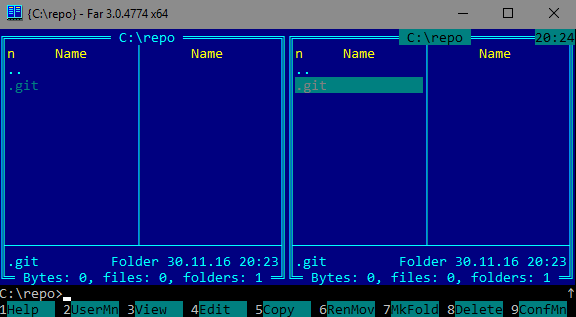

About Git Autocomplete
======================

This [Far Manager](http://farmanager.com/) plugin enables you to quickly substitute names of Git references (branches and tags) into the command line using autocompletion and selection:

For plugin settings, see configuration (`F9` - `Options` - `Plugins configuration` - `Git Autocomplete`) and help (`F1`).

Download and install
====================

To install the plugin, download [the latest distribution](https://github.com/excelsior-oss/far-git-autocomplete/releases/latest) and unzip it into the `%FARPROFILE%` directory.

This shall place:

*   the plugin itself - in the `Plugins` directory (both x86 and x64 versions),
*   a sample macro command - in the `Macros\scripts` directory.

A macro command is required for invoking the plugin with a hotkey. The default one is `Ctrl+G`.
You can create additional macro commands to invoke the plugin with different settings; see help for details.

Alternatively you may download and update the plugin via [PlugRing](http://plugring.farmanager.com/plugin.php?pid=967).

Building from source
====================

To build the plugin and dependent [libgit2 library](https://libgit2.github.com/), you will need:

*   Git
*   CMake
*   Microsoft Visual Studio Community 2015 or higher
*   zip

Download the sources:

    git clone https://github.com/excelsior-oss/far-git-autocomplete.git --recursive

And build everything using "MSBuild Command Prompt for VS2015":

    cd far-git-autocomplete
    build.bat

The plugin will be in the `dist` directory.

Credits
=======

The plugin was originally developed by [Vladimir Parfinenko](https://github.com/cypok) and [Ivan Kireev](https://github.com/ivan2804) during the fifth annual [Excelsior Hack Day](https://www.excelsior-usa.com/blog/news/hack-day-i/).

Released under the MIT/X11 license, see LICENSE.

Copyright © 2016 [Excelsior LLC](https://www.excelsior-usa.com)
